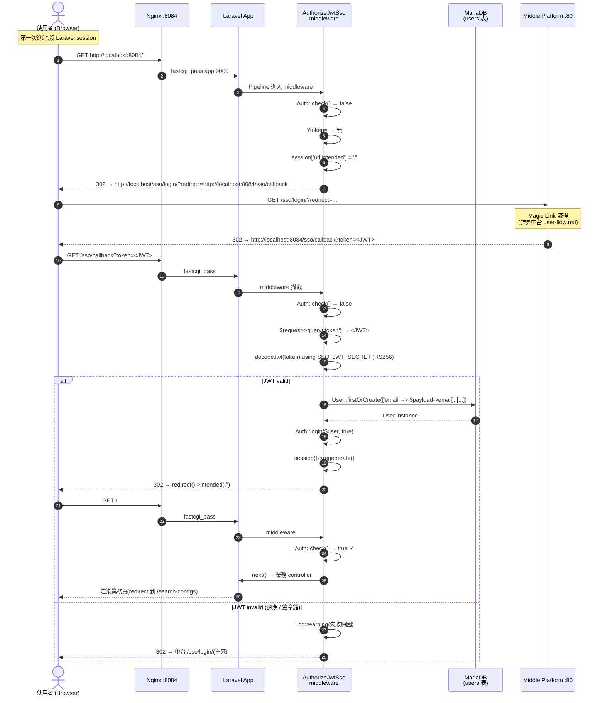
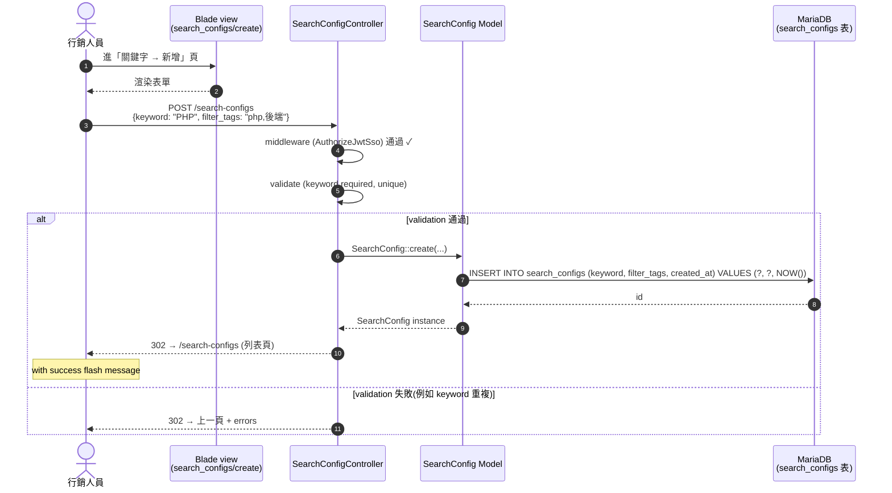
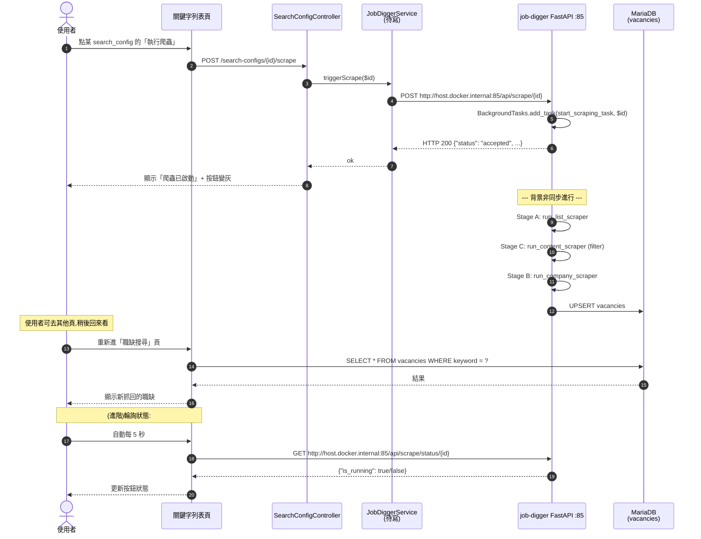
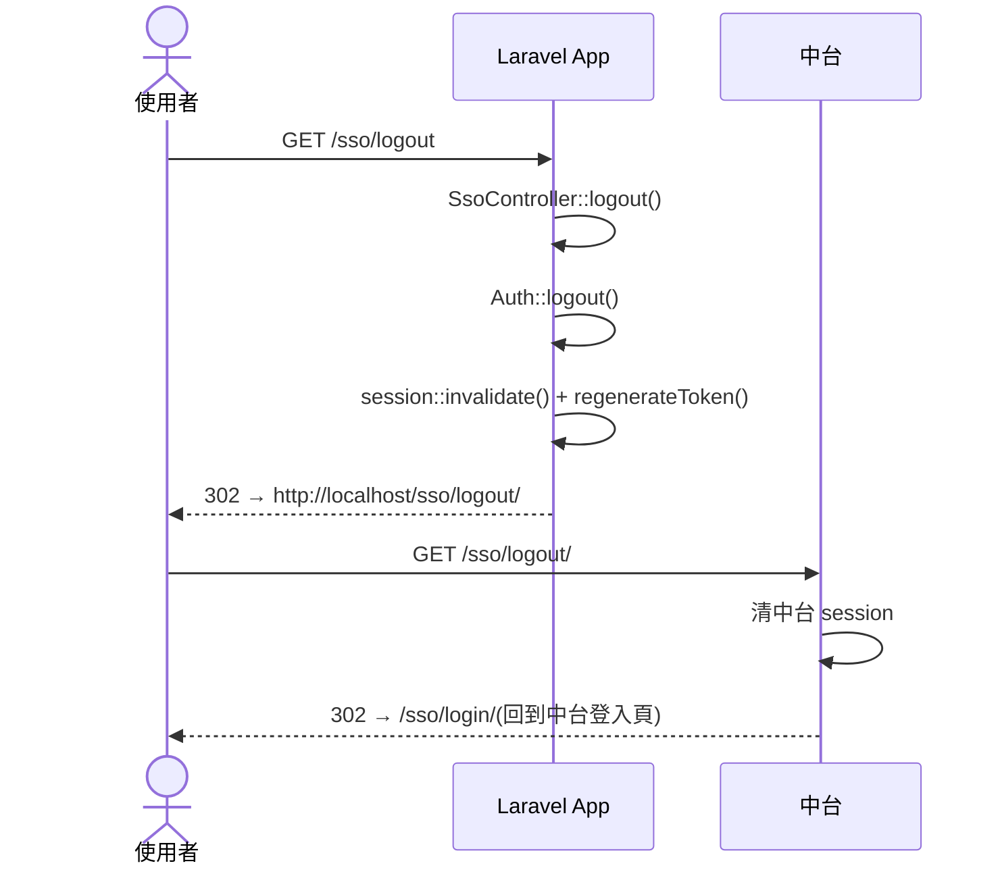
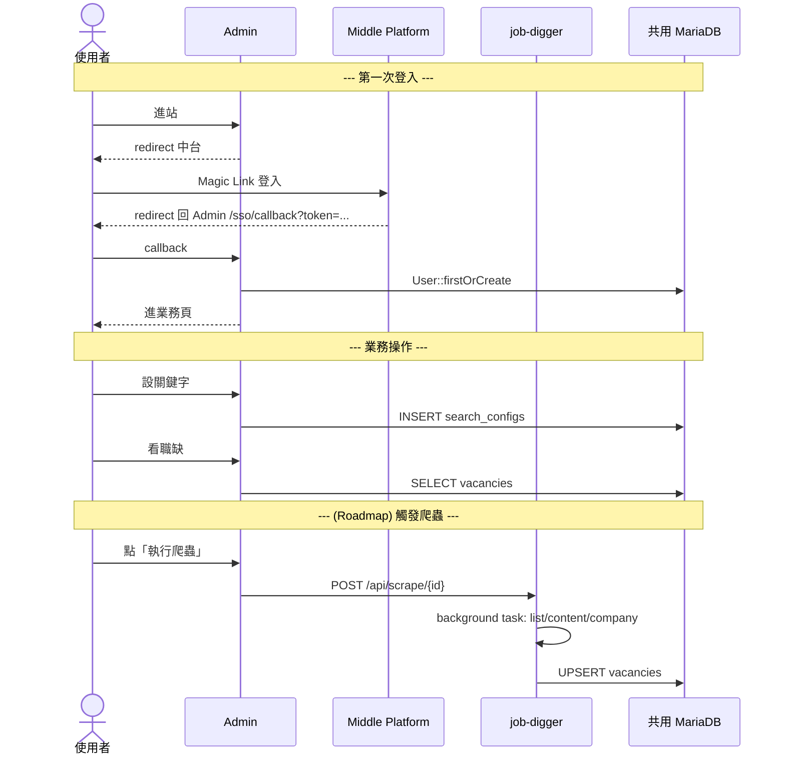

# Sequence Diagrams

本文件用 UML Sequence Diagram 描述 Job Digger Admin 的關鍵互動流程。目標讀者:**SA、開發者、想理解跨系統時序的 Reviewer**。

涵蓋三個流程:

1. SSO 進站(Web Mode)— 從沒登入到看見業務頁
2. Search Config CRUD(常見業務操作)
3. (Roadmap)觸發爬蟲 — Admin → job-digger FastAPI

---

## 1. SSO 進站流程

「使用者第一次點 Admin URL,系統如何處理沒登入這件事?」

**關鍵設計細節**

| 步驟 | 為什麼這樣做 |
|---|---|
| `redirect URL = APP_URL/sso/callback`(固定) | 中台白名單比較容易管,且永遠回到固定接點 |
| `session['url.intended']` | Laravel 內建機制,登入完後 `intended('/')` 自動跳回 |
| `firstOrCreate by email` | email 是中台真實識別,本地 user 只是 mirror |
| `Auth::login + session::regenerate` | 防 session fixation attack |

詳細的 middleware code 見 [`app/Http/Middleware/AuthorizeJwtSso.php`](../app/Http/Middleware/AuthorizeJwtSso.php)。

---

## 2. Search Config CRUD 流程

「我登入後新增一個關鍵字,發生什麼?」

**重點**:
- middleware 只在 **request 進來時驗一次**,過了之後 controller 用 `Auth::user()` 取目前 user 不必再驗 JWT
- `unique:search_configs,keyword` 在 FormRequest validation 已經擋了重複,DB 的 UNIQUE INDEX 是 last line of defense

---

## 3. (Roadmap)觸發爬蟲流程

「Admin 點『執行爬蟲』按鈕,系統如何串到 job-digger?」

> ⚠ 此流程**目前是 stub**,UI 會跳 alert「尚未實作」。本節描述 Roadmap 設計。

**Roadmap 實作要點**

| 項 | 說明 |
|---|---|
| `JobDiggerService` | 新建 `app/Services/JobDiggerService.php`,封裝 HTTP 呼叫(Guzzle) |
| `JOB_DIGGER_API_URL` env | 預設 `http://host.docker.internal:85`,可改 `http://localhost:85`(本機 dev) |
| 「執行中」狀態追蹤 | UI 用輪詢 `GET /api/scrape/status/{id}`,或 server-side flash session 暫存最近啟動的 id |
| 失敗處理 | job-digger API 不會回失敗(內部 task 失敗只在 log),Admin 端用 timeout(例如 10 分鐘沒新資料就提示「可能失敗,請看 docker log」) |
| Rate limit | 同一 keyword 連按多次:job-digger 已用 `active_tasks` set 擋了,Admin 也應該 disable 按鈕 |

---

## 4. 登出流程

**注意**:中台 logout 不會撤銷已簽出去的 JWT(JWT 是無狀態的)。在 Admin 端的 `Auth::logout` 只清本地 session,但 30 分鐘內如果有人複製了 token 還能再進來(走 SSO callback 路徑驗 JWT 通過後重建 session)。要立即撤銷需要 token blacklist,目前 SSO 流程未實作。

---

## 5. 跨系統 overview

整合三個流程的整體 view:

完整中台側的 SSO 細節見 [Middle Platform user-flow.md](../../Middle_Platform/docs/user-flow.md)。
完整 job-digger 側的爬蟲細節見 [job-digger sequence-diagrams.md](../../job-digger/docs/sequence-diagrams.md)。
